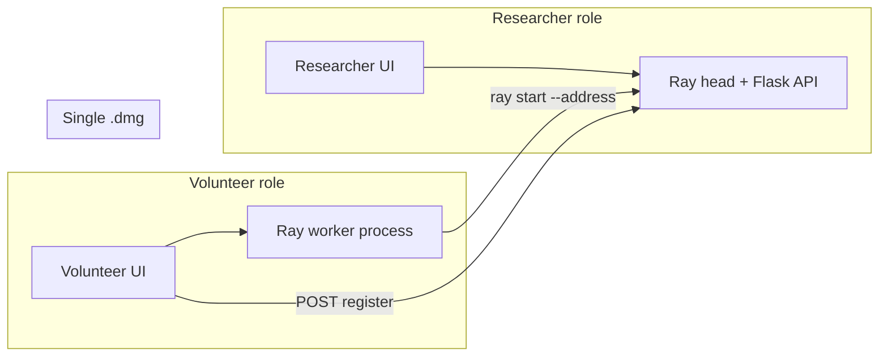

# One .dmg with Two Roles (Researcher + Volunteer) — Demo-Ready Plan

## Current state (summary)

- **Backend:** Flask on 5001 (docs say 5001), Ray head started by API or on first submit. Submit/status/results use legacy `job_id`; Run/Project/Task/Worker/TaskResult schema exists. `/api/workers/connect` runs **on the head** and does `ray.init(address=head)` there, so it registers the head as a “worker,” not the volunteer’s machine. No `/signup` route; no dashboard/stats or results-download endpoints.
- **Frontend:** Hardcoded `localhost:5001` for submit/status/results; Signup posts to `localhost:5001/signup` (no backend route). ResearcherDashboard, Dashboard, ProjectDetails use **mock data**. Home in Electron shows “Start Compute Node” but it only `console.log`s.
- **Electron:** Single app; loads React from dev server or built `dist/`. No role selection, no spawning of Python or Ray.

---

## Architecture (one .dmg, two roles)

- **Researcher:** Chooses “Researcher” in app. For demo, they run the backend (Flask + Ray head) themselves on their laptop, then use the app (upload, dashboard, download). Optionally later: app spawns backend.
- **Volunteer:** Chooses “Volunteer,” enters head node IP, clicks “Connect as worker.” App spawns a **Ray worker process** on their machine (`ray start --address=<head_ip>:6379`) and calls the head’s API to register (user_id, worker_name). No Flask on volunteer machine.

---

## Phase 1: Backend — Fixes and missing APIs

### 1.1 Fix volunteer worker join + user registration + central DB (critical)

**Note:** Backwards compatibility is not a requirement; the system can be rebuilt for the demo. Legacy job_id and old connect flow can be removed or replaced.

---

#### A. User registration route

Add a **single route to register new users** so researchers and volunteers can create accounts in-app (no separate debug script required for demo).

- **Endpoint:** `POST /api/signup` (or `POST /api/register`).
- **Request body:** `full_name`, `email`, `user_id`. All required. `user_id` must be **unique** (client-supplied; e.g. username or chosen ID).
- **Role:** Allow `role` in the body: `researcher`, `volunteer`, or `researcher,volunteer`. Users who are both can **switch between views** in the frontend (researcher view: submit/monitor projects; volunteer view: browse/connect to projects).
- **Backend:** Persist in Constellation DB: insert into `users` with `user_id` (PK), `email` (unique), `name` (full name), `role`. Reject if `user_id` or `email` already exists (409 or 400 with clear message).
- **Schema:** [backend/core/database.py](backend/core/database.py) `User` already has `user_id`, `email`, `name`, `role`. Extend `create_user` (or add a dedicated signup helper) to accept **client-supplied `user_id`** and enforce uniqueness; currently `user_id` is auto-generated by default.

**Summary:** One registration route; full name → `name`, email → `email`, user_id → `user_id` (unique). Role supports researcher, volunteer, or both; frontend switches views based on role.

---

#### B. Projects differentiated by head node IP (connect to projects)

- **Meaning:** "Connect to projects" = connect to the **head node** (the backend) that hosts those projects. The head node is identified by its **IP address** (and port, e.g. `http://<head_ip>:5001`).
- **Backend:** Projects are stored in the **single database** on the head. They are not "differentiated by IP" inside the backend—they are all in one DB. The **IP differentiates which head/instance** the client is talking to (e.g. Researcher A's laptop at 192.168.1.50 vs Researcher B's at 192.168.1.51).
- **Frontend:** User (researcher or volunteer) sets the **API base URL** to the head they want (e.g. `http://192.168.1.50:5001`). All subsequent requests (signup, login, list projects, worker register, etc.) go to that host. So "connecting to projects" is achieved by pointing the app at the correct head node IP.

---

#### C. Central database with SQLite (coordination / validation)

- **Single backend, single DB:** Only **one** process runs the API and the database: the Flask app on the **researcher's machine** (the head node). The SQLite file (e.g. `constellation.db`) lives on that machine. There is **one** DB file per cluster/instance.
- **Everyone uses the same API:** Researchers and volunteers both send requests to the **same** Flask app at the head's base URL (e.g. `http://<head_ip>:5001`). Signup, login, project list, worker register, etc. all hit that one backend, which uses that one SQLite file for validation and storage.
- **No distributed DB:** Coordination is automatic: everyone points at the same head URL; that head has the only copy of the DB. SQLite is "local" only in the sense that the file is on the head machine—not that each client has its own DB. Do **not** run multiple Flask instances (e.g. one per laptop); one head = one backend = one DB.

---

#### D. Fix volunteer worker join

**Problem:** [backend/app.py](backend/app.py) `POST /api/workers/connect` runs on the head; it calls `ray.init(address=head_address)` there, so the “worker” registered is the head node, not the volunteer’s laptop.

**Required flow:**

1. Volunteer runs a **Ray worker on their own machine**: `ray start --address=<head_ip>:6379` (or equivalent).
2. Head’s `ray.nodes()` then sees that new node. Volunteer (or a script) calls the head’s API to **register** that node with `user_id` and `worker_name`.

**Changes:**

- Add `**POST /api/workers/register**` (or repurpose connect): body `{ "user_id", "worker_name" }`. Handler does **not** call `ray.init`. It uses `request.remote_addr` to find the matching node in `ray.nodes()` (by `NodeManagerAddress`), then creates/updates a `Worker` row with that `ray_node_id`, `user_id`, `worker_name`, and marks status `online`. Validate `user_id` has volunteer role (reuse existing DB helpers).
- Remove or deprecate **`POST /api/workers/connect`** for real multi-machine use; document that volunteers must run a Ray worker locally and use the register endpoint.
- Ensure **sync_ray_workers_to_db** in [backend/core/api.py](backend/core/api.py) is called when appropriate (e.g. after register, or on a timer) so new Ray nodes get into the `workers` table; new endpoint can create/update by matching client IP to `NodeManagerAddress` in `ray.nodes()`.

### 1.2 Dashboard and stats API

Add endpoints (in [backend/app.py](backend/app.py)) and backing logic (in [backend/core/database.py](backend/core/database.py) and optionally [backend/core/api.py](backend/core/api.py)):

- `**GET /api/projects**` — List projects (e.g. by researcher_id or all); return `project_id`, `title`, `description`, `created_at`, latest run status if needed.
- `**GET /api/projects/<project_id>**` — Already implied by schema; expose if not present.
- `**GET /api/projects/<project_id>/runs**` or `**GET /api/runs?project_id=**` — List runs for a project.
- `**GET /api/runs/<run_id>**` or `**GET /api/runs/<run_id>/status**` — Run status: `status`, `total_tasks`, `completed_tasks`, `failed_tasks`, `started_at`, `completed_at`, optional `worker_count` (from distinct workers that have tasks for this run).
- `**GET /api/runs/<run_id>/tasks**` — Tasks with status, `assigned_worker_id`, timestamps (for “who is doing what”).
- `**GET /api/workers**` — List workers: `worker_id`, `worker_name`, `status`, `last_heartbeat`, `tasks_completed`, etc.

Add DB helpers in [backend/core/database.py](backend/core/database.py) as needed (e.g. `get_projects_for_researcher`, `get_run_with_stats`, `get_tasks_for_run`, existing `get_available_workers` or list all workers).

### 1.3 Results download and run_id in submit response

- `**GET /api/runs/<run_id>/results/download**` (or `**GET /api/results/<run_id>/download**`): Return aggregated results as a file (e.g. JSON or CSV). Use existing `TaskResult` and Run/Project data; stream or build a single JSON/CSV and return with `Content-Disposition: attachment`.
- **Submit response:** Return `run_id` and `project_id` in the JSON (and optionally `job_id` if still used); frontend drives dashboard and download by `run_id`.

### 1.4 Speedup metric for “8w× faster”

- Option A: In `**GET /api/runs/<run_id>/status**` include `started_at`, `completed_at`, `total_tasks`, and number of workers that participated. Frontend (or a small script) can compute wall-clock duration and show “N workers, ~w× speedup” (or “8w× faster than sequential” if you have a baseline).
- Option B: Add an optional `**sequential_baseline_seconds**` or `**speedup**` field if you compute it server-side. For a minimal demo, Option A is enough.

### 1.5 Signup (demo)

- Implement as specified in **1.1.A:** Add `POST /api/signup` with `full_name`, `email`, `user_id` (unique), `role`; creates user in Constellation DB via [backend/core/database.py](backend/core/database.py); returns `user_id`.

---

## Phase 2: Frontend — Role selection and real data

### 2.1 Role selection and API base URL

- **Role selection:** On first launch (or every launch), show a choice: “I’m a Researcher” / “I’m a Volunteer.” Store in state or localStorage. Redirect or show researcher vs volunteer home content.
- **API base URL:** Replace hardcoded `http://localhost:5001` with a configurable base (e.g. `import.meta.env.VITE_API_URL` or a settings field). Default `http://localhost:5001`. Researcher’s machine runs the backend; volunteers set this to `http://<researcher_ip>:5001`.

### 2.2 Researcher flow (real data)

- **Upload:** Already uses `/submit`; ensure UI shows `run_id`/`project_id` when returned (for “View run” / dashboard link).
- **Researcher dashboard:** Replace mock data in [frontend/src/pages/ResearcherDashboard.tsx](frontend/src/pages/ResearcherDashboard.tsx) with:
  - `GET /api/projects` (or projects for current user) for the list.
  - Per project/run: `GET /api/runs/<run_id>/status` and optionally `GET /api/runs/<run_id>/tasks` and `GET /api/workers` for a real-time view (poll every 2–5 s when a run is active).
- **Progress / workers / throughput:** Use the new endpoints to show: progress (completed_tasks/total_tasks), worker count, and optionally tasks per worker or simple throughput (tasks per second). Optionally show “~w× speedup” from run status.
- **Download results:** Button that calls `GET /api/runs/<run_id>/results/download` and triggers file download (e.g. `window.open` or fetch + blob + save).

### 2.3 Volunteer flow (UI)

- **Volunteer home:** After “I’m a Volunteer,” show: Head node URL (or IP:5001), optional login/signup (or “Use demo volunteer”), “Connect as worker” button.
- **Connect as worker:** In **web** build: show instructions (“Run this on your machine: `ray start --address=<head_ip>:6379` then click Register”); then a form to call `POST /api/workers/register` with `user_id`, `worker_name`. In **Electron** build (Phase 3): this button will start the Ray worker process and then call register.
- **Stop contributing / end processes:** When the volunteer is done, they must stop the Ray worker so it leaves the cluster and frees resources. In **web** build: show instructions to run **`ray stop`** (or equivalent) in their terminal; optionally add a short “When you’re done” section with the command. In **Electron** build (Phase 3): add a **“Stop contributing”** or **“End processes”** button that runs `ray stop` (or kills the spawned Ray worker process) on the volunteer’s machine so they can cleanly disconnect without using the terminal.
- **Current limitation:** The plan as it stands only allows connecting to projects if you know the head node IP ahead of time (no browse/discovery). **For now:** work with one sample research project so the volunteer flow is still demoable (e.g. preconfigure or document the single head IP). See **Future: Volunteer project browsing** below for the promised “browse projects” experience.

### 2.4 Remove mock data

- [frontend/src/pages/ResearcherDashboard.tsx](frontend/src/pages/ResearcherDashboard.tsx): Remove `sampleResearchProjects`; fetch projects and runs from API.
- [frontend/src/pages/Dashboard.tsx](frontend/src/pages/Dashboard.tsx): Either point to real project/run data or make it the volunteer dashboard (e.g. “My contribution” / current worker status).
- [frontend/src/pages/ProjectDetails.tsx](frontend/src/pages/ProjectDetails.tsx): Replace `projectData` with data from route params + API (e.g. `GET /api/projects/<id>` and run status).

### 2.5 Signup and port consistency

- If you add `POST /api/signup`, point [frontend/src/pages/Signup.tsx](frontend/src/pages/Signup.tsx) to the same API base URL (e.g. `http://localhost:5001` or env) and ensure backend runs on that port (e.g. 5001) so submit, status, results, signup, and workers all use one base URL.

---

## Phase 3: Electron — One .dmg, two roles

### 3.1 Role selection and UI

- Reuse the same role selection (Researcher / Volunteer). In Electron, you can persist role in localStorage or a small config file so the correct home is shown.

### 3.2 Researcher mode (backend process)

- **Demo option (simplest):** Do **not** bundle the Python backend. Document: “Researcher: start the backend on this machine (e.g. `python -m flask --app backend.app run --host 0.0.0.0 --port 5001`), then open the app.” App only opens the researcher UI and uses configurable API URL (default localhost:5001).
- **Optional enhancement:** From Electron main, spawn the Flask process (e.g. `python -m flask --app backend.app run --host 0.0.0.0 --port 5001`) if Python is on PATH and project root is known; or bundle a script that the app runs. This is optional for “bare bones” demo.

### 3.3 Volunteer mode — “Start Compute Node”

- **Implement** the “Start Compute Node” / “Connect as worker” behavior in Electron:
  - Use Node in Electron main to spawn: `ray start --address=<head_ip>:6379` (head_ip from UI or config). This starts a Ray **worker** process on the volunteer’s machine.
  - After Ray worker has started (e.g. wait for process spawn or a short delay), call `POST /api/workers/register` on the head (URL from UI: `http://<head_ip>:5001`) with `user_id` and `worker_name` (from volunteer login or demo user).
  - Expose to renderer: e.g. IPC “startWorker(headUrl, user_id, worker_name)” and “getWorkerStatus()”. UI shows “Connected” / “Working” (worker status can come from polling `GET /api/workers` filtered by name or from a simple “registered” state).
  - **Stop contributing:** Expose IPC “stopWorker()” that runs **`ray stop`** (or kills the Ray worker subprocess that was spawned). Add a **“Stop contributing”** or **“End processes”** button in the volunteer UI that calls this so the volunteer can cleanly leave the cluster and free resources without opening a terminal. After stopping, UI should show “Disconnected” and optionally remind them they can “Connect as worker” again later.
- **Prerequisite:** Ray must be installed on the volunteer’s machine (document in README). The .dmg does not need to bundle Ray for a minimal demo.

### 3.4 Packaging

- Keep a **single** Electron app and single .dmg target in [frontend/package.json](frontend/package.json) (`"mac": { "target": "dmg" }`). No separate researcher vs volunteer app; the same binary shows role selection and then researcher or volunteer UI.

---

## Phase 4: Cleanup and demo script

### 4.1 Fixes and removals

| Item                          | Action                                                                                                                                                                                                |
| ----------------------------- | ----------------------------------------------------------------------------------------------------------------------------------------------------------------------------------------------------- |
| `**/api/workers/connect**`    | Stop using it for real volunteer join; add `POST /api/workers/register` and document that volunteers must run `ray start --address=...` first. Optionally keep connect for same-machine testing only. |
| **Legacy job_id**             | No need to preserve; can use `run_id`/`project_id` everywhere. Submit/status/results can return and accept `run_id`; add `run_id` and `project_id` in submit response for dashboard and download.     |
| **Signup**                    | Add `POST /api/signup` (full_name, email, user_id unique, role); wire Signup.tsx to same API base URL. See 1.1.A.                                                                                        |
| **Mock data**                 | Remove from ResearcherDashboard, Dashboard, ProjectDetails; use real API.                                                                                                                             |
| **Home “Start Compute Node”** | Implement in Electron (start Ray worker + register) when in volunteer mode.                                                                                                                           |
| **Volunteer “Stop contributing”** | Document `ray stop` for web; in Electron add a “Stop contributing” / “End processes” button that runs `ray stop` (or kills the spawned worker process) so the volunteer can leave the cluster cleanly. |
| **Port**                      | Standardize on one port (5001) for backend in docs and frontend env.                                                                                                                                  |

### 4.2 Demo runbook

- One-page “Demo runbook”: (1) Researcher: start backend, open app, choose Researcher, start head if needed, upload project, open dashboard. (2) Volunteers: open app, choose Volunteer, enter researcher’s IP, connect as worker (Ray + register). (3) Researcher: start run, watch dashboard, then download results and show “8w× faster” (from run stats). (4) **When the volunteer is done:** they click **“Stop contributing”** / **“End processes”** in the app (Electron) or run **`ray stop`** in their terminal (web) so the Ray worker leaves the cluster and processes are ended. Optionally run `create_debug_user.py` once so researcher and volunteers have user_ids.

---

## Where to start (order of work)

1. **Backend:** Implement **worker register** flow (new endpoint + doc that volunteer runs `ray start` first). Then add **dashboard endpoints** and **run_id in submit** + **results download**. Then **signup** (or lock to debug users).
2. **Frontend:** Add **API base URL** config and **role selection**; replace **ResearcherDashboard** (and related) with real API; add **volunteer “Connect”** UI and **download** button.
3. **Electron:** Implement **volunteer “Start Compute Node”** (spawn Ray + register); optionally researcher “start backend”; ensure **one .dmg** with role selection.
4. **Polish:** Remove remaining mocks, add demo runbook, verify “8w× faster” can be shown from run stats.

---

## Out of scope for this plan

- Bundling Python/Flask or Ray inside the .dmg (researcher runs backend manually or via script; volunteer has Ray installed).
- Full auth (tokens, sessions); demo can use debug users or simple signup returning user_id.
- WebSocket for dashboard (polling is enough for demo).
- Notarization / signing of the .dmg (can be added later).

---

## Future: Volunteer project browsing

We promised that volunteers would be able to **browse projects**, but the current plan only allows connecting to a project if you know the head node IP in advance. There is no discovery mechanism.

**In the future we need:** At least one app page that shows the results of a **database lookup** so volunteers can discover and choose projects instead of typing an IP. Options include:

- A **central discovery service** (e.g. on AWS): a database that stores project/head metadata (project name, description, head URL, optional institution). One app page calls this service to list or search projects (e.g. “projects at my university”) and lets the volunteer pick one; the app then uses the returned head URL to connect. Execution and project data stay on researchers’ heads; the central DB is for browsing only.
- **University-scoped browsing:** Restrict the lookup so volunteers only see projects (or head URLs) for their institution (e.g. by email domain or explicit “I’m at University X”), so you can “browse projects at your university” without a single global list.

### Global DynamoDB (AWS): user authentication + project browsing

The **minimal global store** will live in **DynamoDB** on AWS so users can always log in and browse discoverable projects even when a researcher's head node is offline. Both of the following are part of this global DynamoDB layer:

1. **User authentication** — Users table (e.g. `constellation-users`): `user_id`, `email`, `name`, `role`, and credentials (e.g. `password_hash`) for login. This is the only source of truth for "who is this user?" so login works regardless of which researcher heads are up.
2. **Project browsing (discovery metadata)** — Project registry / index (e.g. `constellation-project-index` or project metadata in a dedicated table): at least `project_id`, `researcher_id`, `title`, `description`, **head_base_url** (or head node URL), and **university/institution** so the app can filter "projects at your university." Volunteers use this to discover which head node to connect to to contribute; execution and full project/runs/tasks data stay on each researcher's head.

Full project data (runs, tasks, workers, results) remains on the researcher's head node (e.g. local SQLite or that head's DB). The global DynamoDB holds only auth + lightweight project metadata for discovery, and discovery is university-scoped for LAN-only use.

**For now (this demo):** Use a single sample research project and document or preconfigure its head IP so volunteers can still connect and the demo works without implementing discovery.

